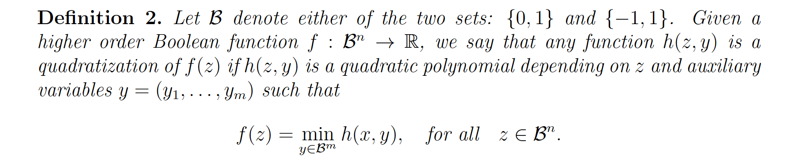
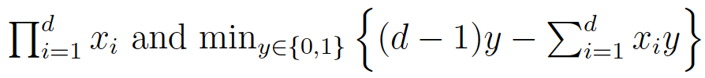
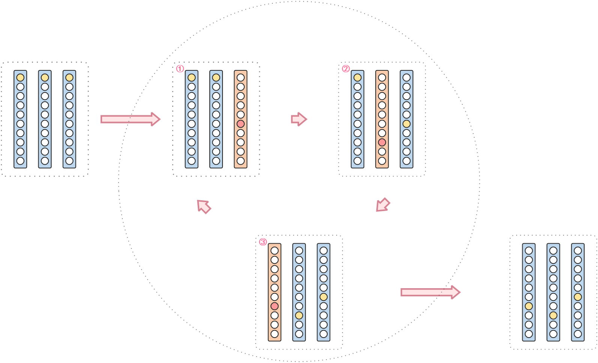
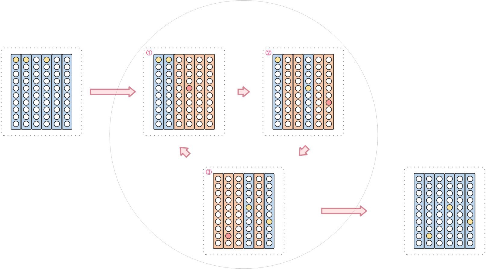

# 一些名词

Ising模型，伊辛模型

QUBO模型，Quadratic Unconstrained Binary Optimization，二次无约束二进制优化模型

* 自旋变量，其域空间取值是`Ising空间`，也就是域空间是$\{-1,1\}$

* 二进制变量，其域空间取值是`布尔空间`，也就是域空间是$\{0,1\}$

HOBO，High Order Binary Optimization，高阶二进制优化问题

组合优化问题，组合优化(Combinatorial Optimization, CO)


# 二次无约束二进制优化(QUBO)模型

> 论文参考： [Quantum bridge analytics I: a tutorial on formulating and using QUBO models | SpringerLink](https://link.springer.com/article/10.1007/s10479-022-04634-2)
>
> 可以将很多组合优化问题重新进行表述为`QUBO`模型，而不同类型的约束关系可以用**惩罚函数**以非常自然的方式体现在“无约束”`QUBO`公式中。**在`QUBO`公式中，使用惩罚函数可以产生比较精确的模型表示**（这句话不是很懂，翻译过来的）。

QUBO模型用于求解NP难问题，该方法用于设计寻找“最优”解决方案的精确求解器基本不可能，**除非是非常小的问题实例**。该模型使用现代**元启发**式方法，在有限的时间内找到接近最优解的方案。


## QUBO基本模型

最简单的`QUBO`模型可以表述为：

$$
\min \quad y=\bold{x}^t \bold{Q} \bold{x}
$$
其中 $\bold{x}$ 是二进制决策变量的**向量**，$\bold{Q}$ 是常数的**方阵**

> 这里的常数方阵$\mathrm{Q}$ 一般在最优化问题中，在不丧失一般性的情况下，使用**对称矩阵**或者**上/下三角形**

对上述进行展开，并改写成标量的形式如下：
$$
\min \sum Q_{i j} x_i x_j
$$


由于$x_i \in \{0,1\}$属于二进制变量，存在$x_i = x_i^2$，因此对于更具一般性的`QUBO`模型表示如下:


$$
\min \sum_{(i, j) \in \mathcal{E}} Q_{i j} x_i x_j+\sum_{i \in \mathcal{X}} c_i x_i
$$
其中，

* $x_i \in\{0,1\}, i \in \mathcal{X}:=\{1, \ldots, X\}$ 是二进制决策变量，并且 $\mathcal{E}:=\{(i, j) \mid i, j \in \mathcal{X}, i \neq j\}$。
* $Q_{i j} \in \mathbb{R},(i, j) \in \mathcal{E}$ ,是`QUBO`目标函数的二次项系数。
* $c_i \in \mathbb{R}, i \in \mathcal{X}$，是`QUBO`目标函数的一次（线性）项系数。


`QUBO`问题可以等价的使用`Ising`模型来表示，通过变量$y_i = 1-2x_i$ 进行转换，将原本`QUBO`模型中决策变量域空间$\{ 0,1 \}$映射到`Ising`模型决策变量域空间$\{ -1 , +1 \}$。转变后的`Ising`模型表述如下：
$$
\begin{aligned}
& \min \sum_{(i, j) \in \mathcal{E}} J_{i j} y_{i} y_{j}+\sum_{i \in \mathcal{X}} h_{i} y_{i}, \\
& J_{i j}=-\frac{1}{4} Q_{i j}\quad, h_{i}=-\frac{1}{2}\left(c_{i}+\sum_{j \in \mathcal{X}} Q_{i j}\right),
\end{aligned}
$$
其中，$y_{i} \in\{-1,1\}, i \in \mathcal{X}$


## 论文中一个小小的案例

最优化问题：最小化二元变量的二次目标函数 $y$：
$$
min \quad y=-5 x_1-3 x_2-8 x_3-6 x_4+4 x_1 x_2+8 x_1 x_3+2 x_2 x_3+10 x_3 x_4
$$
其中，变量 $x_i \in \{ 0 , 1 \}$ 。它有一个**线性部分**（$-5 x_1-3 x_2-8 x_3-6 x_4$）和一个**二次部分**（$4 x_1 x_2+8 x_1 x_3+2 x_2 x_3+10 x_3 x_4$），由于二进制变量 $x_j$ 满足 $x_j=x_j^2$ ，所以线性部分可以写成：

$$
-5 x_1^2-3 x_2^2-8 x_3^2-6 x_4^2
$$
基于此，将优化模型的最小化目标函数写成矩阵形式：


$$
min \quad y=\left[\begin{array}{llll}
x_1 & x_2 & x_3 & x_4 
\end{array}\right]\left[\begin{array}{cccc}
-5 & 2 & 4 & 0 \\
2 & -3 & 1 & 0 \\
4 & 1 & -8 & 5 \\
0 & 0 & 5 & -6
\end{array}\right]\left[\begin{array}{l}
x_1 \\
x_2 \\
x_3 \\
x_4
\end{array}\right]

=\bold{x}^t \bold{Q} \bold{x}
$$

> 由于问题规模较小，穷举($2^4=16$ 种可能) 求出该问题的最优解为：$y=-11,x_1=x_4=1,x_2=x_3=0)$


> 使用python中的`wildqat` 库（`pip install wildqat`，这种方法出现错误，有问题的，因为他依赖于`python3.6`版本的，高版本的python库不兼容，安装有问题）
>
> ```python
>import wildqat as wq
> a = wq.opt()
> a.qubo = [[-5,2,4,0],
> 		  [2,-3,1,0],
>     	  [4,1,-8,5],
> 		  [0,0,5,-6]]
>    a.sa()
> ```
> 
> 这个库有点问题，求的最优解不对，但是可以找到接近最优解。可能是参数设置有问题。


> 使用`PyQUBO`库：[[2103.01708\] PyQUBO: Python Library for Mapping Combinatorial Optimization Problems to QUBO Form (arxiv.org)](https://arxiv.org/abs/2103.01708)
>
> 相关代码：
>
> ```python
> from pyqubo import Binary
> import neal
> 
> # 定义哈密顿量
>    x1, x2, x3, x4 = Binary("x1"), Binary("x2"), Binary("x3"), Binary("x4")
> H = -5 * x1 - 3 * x2 - 8 * x3 - 6 * x4 + 4 * x1 * x2 + 8 * x1 * x3 + 2 * x2 * x3 + 10 * x3 * x4
> 
> # 编译哈密顿量得到一个模型
>model = H.compile()
> 
># 调用'to_qubo()'获取QUBO系数
> # 其中，offset表示下面目标函数中的常数值
># qubo是系数，字典dict类型,{('x2', 'x2'): -3.0,...}表示其系数
> qubo, offset = model.to_qubo()
>
> print(qubo)
> print(offset)
> 
> # 求解qubo模型
> # 将Qubo模型输出为BinaryQuadraticModel，BQM来求解
> bqm = model.to_bqm()
> 
> # 定义采样器，这里使用模拟退火采样器
> sa = neal.SimulatedAnnealingSampler()
> 
> # 进行采样，由于该采样器机制，需要设置高一点的采样个数，这样能够确保能够获得最优值
> # 对应的设置越高，时间花费越久。
> sampleset = sa.sample(bqm, num_reads=10)
> decoded_samples = model.decode_sampleset(sampleset)
> 
> # 将采样出来的结果按照目标函数进行排序，求出最佳（小）的采样结果
> best_sample = min(decoded_samples, key=lambda x: x.energy)
> 
> # 输出采样结果
> print(f"采样取值：{best_sample.sample}，对应的结果为:{best_sample.energy}")
> ```


## 用已知惩罚创建QUBO模型

一般的QUBO模型要求变量为二进制外不包含任何约束。所以如果要实际解决一些有约束条件的问题，需要在目标函数中引入**二次惩罚（quadratic penalties）项**。


|       经典约束       |                等效惩罚                 |
| :------------------: | :-------------------------------------: |
|     $x+y \leq 1$     |                $P(x y)$                 |
|     $x+y \geq 1$     |             $P(1-x-y+x y)$              |
|       $x+y=1$        |            $P(1-x-y+2 x y)$             |
|      $x \leq y$      |               $P(x-x y)$                |
| $x_1+x_2+x_3 \leq 1$ | $P\left(x_1 x_2+x_1 x_3+x_2 x_3\right)$ |
|        $x=y$         |             $P(x+y-2 x y)$              |

> 这里注意一下$P(xy)$表示的是标量$P$ 乘以$(x*y)$，也就是$P*(x*y)$，其他类同。


其中，函数 $P$ 计算出来的是正的标量惩罚值，且这个值计算的必须得足够大。因为，在`QUBO`中，其约束条件是通过优化器来实现的，因此，惩罚项指定的规则是：对于**最小化问题**的求解，如果是可行解，即满足约束条件，对应的惩罚项等于零；对于不可行解，即不满足约束条件的解，其惩罚项等于一些正的惩罚量。对于$P$ 的取值是否合理可以通过求解模型的解，去计算添加的惩罚函数，如果是0，那就说明，$P$值效果可以。

> 惩罚值太大会阻碍求解过程，因为惩罚项会淹没原始目标函数信息，使得很难区分一个解决方案的质量。另一方面，惩罚值过小会危及寻找可行的解决办法。因此，如何确定惩罚值需要进行思考设计。
>
> 对于约束项的设计也有相关的技巧，可以查资料看看。


## 求解

可以将很多组合优化问题重新进行表述为`QUBO`模型，并且可以使用**模拟退火**、量子退火和量子近似优化算法(`QAOA`)等方法对其求解。都是现代**元启发**式搜索方法。

### 量子退火

> 很多专有名词和原理细节可以参考：[D-Wave System Documentation](https://docs.dwavesys.com/docs/latest/index.html)或者查资料。比如说`纠缠（entanglement）`,`耦合器（coupler）`,`本征谱(Eigenspectrum)`,`哈密顿量(Hamiltonian)`,`本征态（eigenstates）`，`初始哈密顿量（Initial Hamiltonian）`，`最终哈密顿量(Final Hamiltonian)`，`隧穿哈密顿量 (tunneling Hamiltonian)`，`问题哈密顿量 (problem Hamiltonian)`。


量子退火是基于耦合量子位的自然行为来寻找**基态**（最低能量状态）的过程。量子退火的过程可以使用根据时间变化的哈密顿量$\mathcal{H}(s)$来表示：
$$
\mathcal{H}(s)=A(s) H_{I}-B(s) H_{P}
$$
其中， $A(s)$和$B(s)$ 是退火路径函数，根据归一化退火时间$s=t / t_{a}$，其中$t_{a}$表示总的退火时间。这样设计可以保证：

* 当$A(0)=1$ 且 $B(0)=0$ ，$\mathcal{H}(s)$表示初始状态$H_I$，由用户自己定义。
* 当$A(1)=0$ 且 $B(1)=0$ ，$\mathcal{H}(s)$表示退火后的状态$H_P$，这一项也称为问题哈密顿量 (`problem Hamiltonian`)，是最小能量状态。

那么在设计的时候，初始状态的设计可以根据问题进行简单设计，比如：
$$
H_{I}=\sum_{i} \sigma_{i}^{x}
$$
其中，$\sigma_{i}^{x}$表示第 $i$ 个量子位的$Pauli-x$ 算子（泡利$-x$算子）。

而问题哈密顿量，也就是$H_P$设计可通过最优化的目标函数给出：
$$
H_{P}=\sum_{i, j} J_{i j} \sigma_{i}^{z} \cdot \sigma_{j}^{z}+\sum_{i} h_{i} \sigma_{i}^{z} 
$$
其中，$\sigma_{i}^{z}$表示第 $i$ 个量子位的$Pauli-z$ 算子（泡利$-z$ 算子）。

量子退火器首先初始化量子位的叠加态使得$\mathcal{H}(0)=H_{I}$，然后在退火时间内操作量子位耦合，使$\mathcal{H}(s)$朝向$ H_{P}$发展，退火结束后，就处于 problem Hamiltonian 的本征态（eigenstate）。根据量子计算的绝热定理，如果退火时间足够长，该时变哈密顿量$\mathcal{H}(s)$将始终保持基态，即最优化函数($\mathcal{H}(s)$的解)。


### 模拟退火

模拟退火算法（Simulated Annealing，SA）是一种通用的全局优化算法，用于在搜索空间中找到最优解。它的基本原理是模拟物理学中的退火过程，通过温度参数控制搜索过程中接受次优解的概率，从而避免陷入局部最优解。 模拟退火算法的基本流程如下： 

1. 初始化一个解 $x_0$ 和一个初始温度 $T_0$。 

2. 在该温度下，进行迭代，每次迭代进行以下操作：   

   a. 从当前解 $x$ 的邻域中随机选择一个新解 $x'$。   

   b. 计算 $x'$ 的目标函数值 $f(x')$ 和 $x$ 的目标函数值 $f(x)$。   

   c. 根据Metropolis准则判断是否接受新的解，即如果 $f(x')<f(x)$，则以概率 $1$ 接受 $x'$ 作为新的解；否则以概率 $e^{-\Delta f/T}$ 接受 $x'$，其中 $\Delta f=f(x')-f(x)$。 

3. 更新温度 $T$，并重复步骤 2 直到温度满足停止条件

其中，温度 $T$ 是一个随着时间逐渐降低的参数，控制着算法接受次优解的概率。


由上述算法可知，其迭代效果受到初始温度、降温速率和终止温度三个参数的影响。

* 初始温度通常设置为一个较高的值，以保证在搜索的早期能够接受一些劣解，从而有更大的概率跳出局部最优解。

* 终止温度通常设置为一个较小的值，当温度降到终止温度时，搜索停止，此时得到的解就是算法得到的最优解。

* 降温速率通常设置为一个小于1的常数，降温速率越慢，则搜索的时间越长，但是搜索范围也就越广，有更大的概率找到全局最优解。

因此需要合理设置初始温度、降温速率和终止温度三个参数以便能够快速达到最优解。


这里介绍一下[dwave-samplers](https://github.com/dwavesystems/dwave-samplers)库中的`SimulatedAnnealingSampler`采样器以及对应的参数。

在该库中，初始温度和终止温度是通过$\frac{1}{TK}$转换为$\beta_1$和$\beta_0$（其中，$K$是波尔兹常量），通过传入参数 $\text{beta\_range} =[\beta_0,\beta_1]$传入。而降温速率一般通过`beta_schedule_type`和`num_sweeps`来设置：对于`beta_schedule_type`参数，有三种方式：

* "linear"：线性，在$[\beta_0,\beta_1]$中线性获取`num_sweeps`个采样点作为每次更新温度的数值
* "geometric"，几何，在$[\beta_0,\beta_1]$中通过`np.geomspace(*beta_range, num=num_betas)`获取`num_sweeps`个采样点作为每次更新温度的数值。
* "custom"：用户自定义 


## 量子近似优化算法(QAOA)

量子近似优化算法可以使用[QPanda](https://qpanda-tutorial.readthedocs.io/zh/latest/)库，这部分不是很了解，有时间后面补充。


# 高阶问题（HOBO）

主要解决的问题是：对于`QUBO`模型中高于二次项的目标函数该如何求解问题

> 参考论文：[[2001.00658\] Compressed Quadratization of Higher Order Binary Optimization Problems (arxiv.org)](https://arxiv.org/abs/2001.00658)
>
> 在不同论文中有不同的叫法：
>
> * Higher Order Binary Optimization (`HOBO`)：高阶二进制优化
> * termwise quadratizationquadratization:按期限平方，这个是将单项式单次转换为二次。也就是$x_i = x_i^2, \quad where \quad x_i \in{0,1}$


高阶二元优化问题的压缩二次化：对于目前而言，存在一种使用**Rosenberg多项式**来**减少高阶优化问题**次数的方法，该方法在布尔空间中通过引入一个额外的变量来减少一个项的次数，这种方法最终会导致最后的布尔空间矩阵很稀疏，并且问题规模会变大。然后在论文中，提出了一种直接在原有布尔空间中运行的降阶方法，而不通过增加额外变量的方式。


论文中有个没看懂：



> 感觉这里的$x$打错了，应该是$z$，然后想表达的意思应该是，对于$z$属于布尔空间的取值，可以通过增加变量 $y$，使得当 $y$ 取某个**特定值**的时候 $h(z,y_{取特定值})$等价于$f(z)$，由于 $h$ 函数不确定，只是说能找到该函数满足等价这个条件，那么再做一个限定，也就是当$y$取该**特定值**的时候，正好是$h(z,y_{取特定值})$取到最小值，
>
> 那么根据贪心思想，很容易理解，到时候  最小化$f(z)$  等价于 最小化 $h(z,y)$


基于此，就有等价：



这个比较难理解，但是，想到$x_i \in \{ 0 , 1 \}$，并且，这里y是很多个的组合，并且$y_i \in \{ 0, 1\}$就比较容易穷举，在论文`Linear and quadratic reformulations of nonlinear optimization problems in binary variables`中证明了对于最高次数$d$，需要的变量$y$个数是$\lceil\log d\rceil-1$。（**感觉公式表达有问题**）

> 这种代替方式有两个问题，具体可以看看论文，我们没有使用变量代替降次，所以对于这个`HOBO`没有仔细研究。


# 2023年mathorcup的A题


## 数学定义


|                名词                |                         数学表达                          |
| :--------------------------------: | :-------------------------------------------------------: |
|      贷款金额（Loan amount）       |                  $L$，固定值，为1000000                   |
| 利息收入率（Interest income rate） |                     $I$，固定值，为8%                     |
|          通过率矩阵，$T$           | 其中，$T_{i,j}$表示第$i$个信用评分卡的第$j$个阈值的通过率 |
|          坏账率矩阵，$H$           | 其中，$H_{i,j}$表示第$i$个信用评分卡的第$j$个阈值的坏账率 |
|              总通过率              |                            $P$                            |
|              总坏账率              |                            $Q$                            |
|     集合空间，具体在文章中说明     |                       $\mathcal{X}$                       |
|               约束项               |                        $\lambda $                         |
|              最终收入              |                            $H$                            |


## 问题一


对于问题一，我们定义决策变量 $x_{i,j}$ 用于表示：
$$
x_{i,j}=\left\{ \begin{array}{c} 
	0 \quad ,不选第\ i\ 个信用评分卡的第\ j\ 个阈值 \\
	1 \quad ,选第\ i\ 个信用评分卡的第\ j\ 个阈值\\
\end{array} \right.
$$
那么对于决策变量 $x_{i,j}$ 对应的通过率 $P_{i,j}$ 与坏损率 $Q_{i,j}$ 有：
$$
P_{i,j} = x_{i,j} \ * \ T_{i,j} \\
Q_{i,j} =  x_{i,j} \ * \ H_{i,j}
$$
于是决策变量 $x_{i,j}$ 对应的最终收入 $H_{i,j}$ 有
$$
H_{i,j} = L \ * \ I \ * \ P_{i,j} \ * \ (1-Q_{i,j})  \ - \ L \ * \ P_{i,j} \ * \ Q_{i,j}
$$
考虑整体，也就是最终收入 $H$ 有
$$
H = \sum_{{(i, j) \in \mathcal{X}}} H_{i,j} \\
= \sum_{i=1}^{100} \sum_{j=1}^{10} [{L \ * \ I \ * \ P_{i,j} \ * \ (1-Q_{i,j})  \ - \ L \ * \ P_{i,j} \ * \ Q_{i,j}}] \\
= L \ * \ I \ * \sum_{i=1}^{100} \sum_{j=1}^{10}P_{i,j}  - L*(I+1)*\sum_{i=1}^{100} \sum_{j=1}^{10}(P_{i,j} \ * \ Q_{i,j}) 
\\
=  L \ * \ I \ * \sum_{i=1}^{100} \sum_{j=1}^{10}(T_{i,j} \ * \ x_{i,j})  - L*(I+1)*\sum_{i=1}^{100} \sum_{j=1}^{10}(T_{i,j} \ * \ H_{i,j} \ * \ x_{i,j}^2)
$$
对于最终收入，我们考虑最小化目标函数 $-H$,即
$$
min \ -H = L*(I+1)*\sum_{i=1}^{100} \sum_{j=1}^{10}(T_{i,j} \ * \ H_{i,j} \ * \ x_{i,j}^2) - L \ * \ I \ * \sum_{i=1}^{100} \sum_{j=1}^{10}(T_{i,j} \ * \ x_{i,j})
$$
考虑约束条件：由于在整体中只有一个评分卡的阈值能被选取，因此在决策变量$x_{i,j}$中只有一个是1，即：
$$
\sum_{{(i, j) \in \mathcal{X}}} x_{i,j}= \sum_{i=1}^{100} \sum_{j=1}^{10} x_{i,j} = 1
$$

> 这里的 $\mathcal{X}$ 空间定义为：$\mathcal{X}:=\{(i, j) \mid i \in \{1,2,...,100\}, j \in \{1,2,...,10 \} \}$


综上所述：
$$
min \ -H = L*(I+1)*\sum_{i=1}^{100} \sum_{j=1}^{10}(T_{i,j} \ * \ H_{i,j} \ * \ x_{i,j}^2) - L \ * \ I \ * \sum_{i=1}^{100} \sum_{j=1}^{10}(T_{i,j} \ * \ x_{i,j}) \\
s.t. \quad \sum_{i=1}^{100} \sum_{j=1}^{10} x_{i,j} = 1
$$
通过添加约束项 $\lambda$ 将上述二次有约束二进制优化模型改写为二次无约束二进制优化模型（`QUBO`）:
$$
min \ \ y = L*(I+1)*\sum_{i=1}^{100} \sum_{j=1}^{10}(T_{i,j} \ * \ H_{i,j} \ * \ x_{i,j}^2) - L \ * \ I \ * \sum_{i=1}^{100} \sum_{j=1}^{10}(T_{i,j} \ * \ x_{i,j}) + \lambda * (\sum_{i=1}^{100} \sum_{j=1}^{10} x_{i,j} - 1)^2
$$


对于问题一的**枚举暴力**代码实现：

```python
import time
import pandas as pd

if __name__ == '__main__':
    # 定义一些变量
    L = 1000000  # 贷款资金
    I = 0.08  # 利息收入率

    df = pd.read_csv('./data/附件1：data_100.csv', header=0)

    # 定义最大的数
    max_value = -1

    # 定义最大数字的索引下标
    max_i = max_j = -1

    start = time.time()

    for i in range(1, 101):
        for j in range(0, 10):

            # 总通过率
            P = df[f"t_{i}"].iloc[j]

            # 总坏账率
            Q = df[f"h_{i}"].iloc[j]

            # 此时的最终收入
            temp_value = L * I * P * (1 - Q) - L * P * Q

            # print(f"选卡[{i},{j + 1}]，对应最终收入{temp_value},最大收入:{max_value}")

            if temp_value > max_value:
                max_value = temp_value
                max_i = i
                max_j = j

    end = time.time()
    print(f"暴力时间：{end - start} s")

    print(f"最大值：{max_value}")
    print(f"对应的选取卡1：第{max_i}张{max_j + 1}个阈值")
```

使用`QUBO`模型+模拟退火算法实现：

```python
import time
from pyqubo import Array, Constraint
from dwave.samplers import SimulatedAnnealingSampler

import numpy as np
from pyqubo import Placeholder


# 在字典中找到value的key
def get_key(dict, value):
    return [k for k, v in dict.items() if v == value]


# 主函数,问题一的主要求解函数
def main():
    # 定义一些变量
    L = 1000000  # 贷款资金
    I = 0.08  # 利息收入率

    # 读取数据
    data = np.genfromtxt('./data/附件1：data_100.csv', delimiter=',', skip_header=1)

    # 获取T矩阵和H矩阵
    T = data[:, ::2]
    H = data[:, 1::2]

    # 定义二进制决策变量,10 * 100
    x = Array.create('x', shape=(10, 100), vartype='BINARY')

    # 定义惩罚项M
    M = Placeholder('M')
    M = 100000

    # 定义哈密顿量,也就是对应的目标函数
    # 注意这里不是总通过率和总坏账率，是中间变量，将最终决策目标的连加符号放到里面整出来的
    P = np.sum(np.multiply(x, T))
    Q = np.sum(np.multiply(x, H))
    H = - (L * I * P * (1 - Q) - L * P * Q) + M * Constraint((np.sum(x) - 1) ** 2, label='sum(x_i_j) = 1')

    # 编译哈密顿量得到一个模型
    model = H.compile()

    # 将Qubo模型输出为BinaryQuadraticModel，BQM来求解
    bqm = model.to_bqm()

    # 记录开始退火时间
    start = time.time()

    # 模拟退火
    sa = SimulatedAnnealingSampler()
    sampleset = sa.sample(bqm, seed=666, beta_range=[10e-10, 50], num_sweeps=10000, beta_schedule_type='geometric',num_reads=10)


    # 对数据进行筛选，对选取的数据进行选取最优的
    decoded_samples = model.decode_sampleset(sampleset)  # 将上述采样最好的num_reads组数据变为模型可读的样本数据
    best_sample = min(decoded_samples, key=lambda x: x.energy)  # 将能量值最低的样本统计出来，表示BQM的最优解

    end = time.time()
    print(f"退火时间花费：{end - start} s")

    # 统计决策变量为1的所有数据
    data_1_list = get_key(best_sample.sample, 1)

    print(f"对应的取1的决策变量有：{data_1_list}(注意是索引，从0开始),对应的能量为(最大最终收入):{- best_sample.energy}")
    
    
if __name__ == '__main__':
    main()
```


> 对于问题一，虽然暴力穷举比`QUBO`模型+模拟退火算法运行时间快，但是考虑算法时间复杂度：卡有$m$张，阈值选取有$n$个
>
> * 暴力穷举算法，由于有循环，因此是$O(mn)$
> * `QUBO`模型+模拟退火算法，属于是现代元启发式优化算法，在数据较多时，尤其是NP问题上，规模越大，其运行速度相对暴力要快的多。


## 问题二

对于问题二，我们考虑了两种QUBO模型的理解：

* 定义决策变量 $x_{i,j,k}$ 表示是否选：第1张信用评分卡选第 $i$个阈值，第2张信用评分卡选第 $j$个阈值，第3张信用评分卡选第 $k$个阈值。
* 主要来源于暴力穷举过程的一种发现，固定前两张信用评分卡的阈值选择，定义第三张信用评分卡第 $i$ 个阈值是否选择作为决策变量 $x_i$ ，决策出第三张信用评分卡的最佳阈值后，同理决策出其他两张信用卡的最佳阈值。多迭代几轮，这种方法决策出来的阈值在该问题中就是最佳的阈值组合。

具体看下面内容：


### QUBO

定义决策变量 $x_{i,j,k}$ 用于表示:
$$
x_{i,j,k}=\left\{ \begin{array}{c} 
	0 \quad ,不选: \ 第1张信用评分卡选第 \ i \ 个阈值，第2张信用评分卡选第 \ j \ 个阈值，第3张信用评分卡选第 \ k \ 个阈值 \\
	1 \quad ,选: \ 第1张信用评分卡选第 \ i \ 个阈值，第2张信用评分卡选第 \ j \ 个阈值，第3张信用评分卡选第 \ k \ 个阈值 \\
\end{array} \right.
$$
那么对于决策变量 $x_{i,j,k}$ 对应的通过率 $P_{i,j,k}$ 与坏损率 $Q_{i,j,k}$ 有：
$$
P_{i,j,k} = x_{i,j,k} \ * \ T_{1,i} \ * \ T_{2,j} \ * \ T_{3,k} \\
Q_{i,j,k} =  x_{i,j,k} \ * \  \frac{1}{3} \ * \  (H_{1,i} \ + \ H_{2,j} \ + \ H_{3,k})
$$
于是决策变量 $x_{i,j,k}$ 对应的最终收入 $H_{i,j,k}$ 有
$$
H_{i,j,k} = L \ * \ I \ * \ P_{i,j,k} \ * \ (1-Q_{i,j,k})  \ - \ L \ * \ P_{i,j,k} \ * \ Q_{i,j,k}
$$
考虑整体，也就是最终收入 $H$ 有
$$
H = \sum_{{(i, j, k) \in \mathcal{X}}} H_{i,j,k} \\


= \sum_{i=1}^{10} \sum_{j=1}^{10} \sum_{k=1}^{10} \ [ {L \ * \ I \ * \ P_{i,j,k} \ * \ (1-Q_{i,j,k})  \ - \ L \ * \ P_{i,j,k} \ * \ Q_{i,j,k}} ]\\


= L \ * \ I \ * \sum_{i=1}^{10} \sum_{j=1}^{10} \sum_{k=1}^{10}P_{i,j,k}  - L*(I+1)*\sum_{i=1}^{10} \sum_{j=1}^{10} \sum_{k=1}^{10}(P_{i,j,k} \ * \ Q_{i,j,k}) 
\\


=  L \ * \ I \ * \sum_{i=1}^{10} \sum_{j=1}^{10} \sum_{k=1}^{10}
[( T_{1,i}  *  T_{2,j}  *  T_{3,k} ) \ * \ x_{i,j,k}]
\\

-\frac {L*(I+1)}{3} * \sum_{i=1}^{10} \sum_{j=1}^{10} \sum_{k=1}^{10}
[(H_{1,i} + H_{2,j} + H_{3,k}) * T_{1,i}  *  T_{2,j}  *  T_{3,k} * x_{i,j,k}^2]
$$
同样考虑最小化目标函数 $-H$ ,此时决策变量的约束条件为：(只有一种方案选取)
$$
\sum_{{(i, j, k) \in \mathcal{X}}} x_{i,j,k}= \sum_{i=1}^{10} \sum_{j=1}^{10} \sum_{k=1}^{10} x_{i,j,k} = 1
$$

> 这里的 $\mathcal{X}$ 空间定义为：$\mathcal{X}:=\{(i, j,k) \mid i,j,k \in \{1,2,...,10\} \}$


综上所述：
$$
min \ -H = L \ * \ I \ * \sum_{i=1}^{10} \sum_{j=1}^{10} \sum_{k=1}^{10}
[( T_{1,i}  *  T_{2,j}  *  T_{3,k} ) \ * \ x_{i,j,k}]
\\

-\frac {L*(I+1)}{3} * \sum_{i=1}^{10} \sum_{j=1}^{10} \sum_{k=1}^{10}
[(H_{1,i} + H_{2,j} + H_{3,k}) * T_{1,i}  *  T_{2,j}  *  T_{3,k} * x_{i,j,k}^2] \\


s.t. \quad \sum_{i=1}^{10} \sum_{j=1}^{10} \sum_{k=1}^{10} x_{i,j,k} = 1
$$
通过添加约束项 $\lambda$ 将上述二次有约束二进制优化模型改写为二次无约束二进制优化模型（`QUBO`）:
$$
min \ \ y = L \ * \ I \ * \sum_{i=1}^{10} \sum_{j=1}^{10} \sum_{k=1}^{10}
[( T_{1,i}  *  T_{2,j}  *  T_{3,k} ) \ * \ x_{i,j,k}]
\\

-\frac {L*(I+1)}{3} * \sum_{i=1}^{10} \sum_{j=1}^{10} \sum_{k=1}^{10}
[(H_{1,i} + H_{2,j} + H_{3,k}) * T_{1,i}  *  T_{2,j}  *  T_{3,k} * x_{i,j,k}^2] \\  + \lambda * (\sum_{i=1}^{10} \sum_{j=1}^{10} \sum_{k=1}^{10} x_{i,j,k} - 1)^2
$$


> 在代码实现过程中，由于需要计算总通过率$T_{1,i} \ * \ T_{2,j} \ * \ T_{3,k}$以及总坏账率$ \frac{1}{3} *  (H_{1,i}  +  H_{2,j}  + H_{3,k})$ 。如果使用for循环效率比较慢，这里使用了`numpy`库中的广播机制来获得相关计算矩阵。

代码实现如下：

```python
import time
from pyqubo import Array, Constraint
from dwave.samplers import SimulatedAnnealingSampler
import numpy as np
from pyqubo import Placeholder


# 在字典中找到value的key
def get_key(dict, value):
    return [k for k, v in dict.items() if v == value]


def main():
    # 定义一些变量
    L = 1000000  # 贷款资金
    I = 0.08  # 利息收入率

    # 表示选取的卡号
    card1, card2, card3 = 1, 2, 3

    # 读取数据
    data = np.genfromtxt('../data/附件1：data_100.csv', delimiter=',', skip_header=1)

    # 获取T矩阵和H矩阵
    T = data[:, ::2]
    H = data[:, 1::2]

    # 定义二进制决策变量,10 * 100
    x = Array.create('x', shape=(10, 10, 10), vartype='BINARY')

    # 定义惩罚项M
    M = Placeholder('M')
    M = 30000

    # 定义哈密顿量,也就是对应的目标函数
    # 注意这里不是总通过率和总坏账率，是中间变量，将最终决策目标的连加符号放到里面整出来的
    T1 = T[:, card1 - 1]
    T2 = T[:, card2 - 1]
    T3 = T[:, card3 - 1]

    H1 = H[:, card1 - 1]
    H2 = H[:, card2 - 1]
    H3 = H[:, card3 - 1]

    # 计算三种组合后的总通过率和总坏账率,通过广播机制来实现
    T = T1[:, None, None] * T2[None, :, None] * T3[None, None, :]
    H = (H1[:, None, None] + H2[None, :, None] + H3[None, None, :]) / 3

    P = np.sum(np.multiply(x, T))
    Q = np.sum(np.multiply(x, H))
    H = - (L * I * P * (1 - Q) - L * P * Q) + M * Constraint((np.sum(x) - 1) ** 2, label='sum(x_i_j) = 1')

    # 编译哈密顿量得到一个模型
    model = H.compile()

    # 将Qubo模型输出为BinaryQuadraticModel，BQM来求解
    bqm = model.to_bqm()

    print("开始模拟退火")

    start = time.time()
    sa = SimulatedAnnealingSampler()
    sampleset = sa.sample(bqm, seed=888, beta_range=[10e-12, 60], beta_schedule_type='geometric', num_reads=50)

    # 对数据进行筛选
    decoded_samples = model.decode_sampleset(sampleset)  # 将上述采样最好的num_reads组数据变为模型可读的样本数据
    best_sample = min(decoded_samples, key=lambda x: x.energy)  # 将能量值最低的样本统计出来，表示BQM的最优解

    # print(f"验证约束条件M：{best_sample.constraints()}")
    end = time.time()
    print(f"退火时间：{end - start} s")

    # print(best_sample.sample)

    # 统计决策变量为1的所有数据
    data_1_list = get_key(best_sample.sample, 1)

    print(f"对应的取1的决策变量有：{data_1_list}(表示[第一张卡的阈值][第二张卡的阈值][第三张卡的阈值]，注意是索引，从0开始),对应的能量为{-best_sample.energy}")


if __name__ == '__main__':
    main()
```


### 枚举暴力

对应的枚举暴力代码如下：

```python
import pandas as pd

if __name__ == '__main__':
    # 定义一些变量
    L = 1000000  # 贷款资金
    I = 0.08  # 利息收入率

    # 选取第几列的信用卡
    card1 = 1
    card2 = 2
    card3 = 3

    df = pd.read_csv('../data/附件1：data_100.csv', header=0)
    # 定义最大的数
    max_value = -1

    # 定义最大数字的索引下标
    max_i = max_j = max_k = -1

    for i in range(0, 10):
        for j in range(0, 10):
            for k in range(0, 10):
                # 总通过率
                P = df[f"t_{card1}"].iloc[i] * df[f"t_{card2}"].iloc[j] * df[f"t_{card3}"].iloc[k]

                # 总坏账率
                Q = (df[f"h_{card1}"].iloc[i] + df[f"h_{card2}"].iloc[j] + df[f"h_{card3}"].iloc[k]) / 3

                # 此时的最终收入
                temp_value = L * I * A * (1 - B) - L * A * B

                # print(f"选卡1阈值：[{i + 1}]，选卡1阈值：[{j + 1}]，选卡1阈值：[{k + 1}]，对应最终收入{temp_value},之前的最大收入:{max_value}")

                if temp_value > max_value:
                    max_value = temp_value
                    max_i = i
                    max_j = j
                    max_k = k

        print(f"第{i + 1}个对应的最大值：{max_value},三个阈值选取为:{max_i + 1},{max_j + 1},{max_k + 1},其中，阈值编号[1-10]")

    print(f"最大值：{max_value},三个阈值选取为:{max_i + 1},{max_j + 1},{max_k + 1},其中，阈值编号[1-10]")
```


### 贪心+ QUBO

在运行过程中，发现一个对第三问很有帮助的规律：可以把上面的决策过程（for循环）打印出来看一下：

对于第一个循环，其决策过程是：`[1,1,2]-->[2,1,2]-->[3,1,2]-->[3,1,2]-->[3,1,2]-->[6,1,2]-->[7,1,2]-->[8,1,2]-->[8,1,2]-->[8,1,2]`。这里打印出来结果比较少，可能看的不是很明显规律。但是容易发现：

对于三张评分信用卡的决策过程，如果固定第一张和第二张评分信用卡的阈值选取，而考虑第三张评分信用卡的阈值选取，此时选择最优的信用评分卡阈值。然后固定第一张和第三张评分信用卡的阈值选取，而考虑第二张评分信用卡的阈值选取，此时也选择最优的信用评分卡阈值。然后固定第二张和第三张评分信用卡的阈值选取，而考虑第一张评分信用卡的阈值选取，此时也选择最优的信用评分卡阈值。基于此不停的迭代，那么最终获得的阈值选取就是最优的阈值组合。（可以考虑证明一下）。





基于该过程，我们就可以将原本 $10 \times 10 \times 10$ 个决策变量的求解转换为 $迭代次数 \times 10$ 个决策变量的问题。这对于问题三而说是非常重要的一种发现。对于问题三，原本是 $1000 \times 990 \times 980$ 个决策变量问题转换为了 $迭代次数 \times 980$ 个决策变量规模的问题。


## 问题三

最开始我们考虑的是：设计决策变量$x_{i,j}$ 用于表示：
$$
x_{i,j}=\left\{ \begin{array}{c} 
	0 \quad ,不选第\ i\ 个信用评分卡的第\ j\ 个阈值 \\
	1 \quad ,选第\ i\ 个信用评分卡的第\ j\ 个阈值\\
\end{array} \right.
$$
在不考虑约束条件的情况下，整体的通过率$P$和坏损率$Q$满足：
$$
P =\prod_{(i,j) \in \mathcal{X}}(x_{i,j}*T_{i,j} +1-x_{i,j})  = \prod_{(i,j) \in \mathcal{X}}(T_{i,j}^{x_{i,j}})  \\


Q = \frac{1}{3} * \sum_{(i,j) \in \mathcal{X} }( H_{i,j} * x_{i,j})
$$
对应的最终收入$H$有：
$$
H = L \ * \ I \ * \ P \ * \ (1-Q)  \ - \ L \ * \ P \ * \ Q
$$
可以发现，如果使用 $P =\prod_{(i,j) \in \mathcal{X}}(x_{i,j}*T_{i,j} +1-x_{i,j}) $ 这个公式，其目标函数中，决策变量的最高次项系数为$1001$次。转换为了$HOBO$模型，需要降次，感觉很复杂。不考虑。

如果使用 $P = \prod_{(i,j) \in \mathcal{X}}(T_{i,j}^{x_{i,j}})$ 这个公式，然后考虑使用多项式近似(Polynomial approximation)的思想，将指数项使用多项式展开，比如泰勒级数展开式：$e^{ax} = \sum_{n=0}^{\infty} \frac{(ax)^n}{n!}$，保留一阶项，即： $ e^{ax} \approx 1+ax$ 。也就可以将指数项转换为一个多项式函数的线性项：
$$
P = \prod_{(i,j) \in \mathcal{X}}(T_{i,j}^{x_{i,j}}) = exp \{ \sum_{(i,j) \in \mathcal{X}} [x_{i,j}* ln(T_{i,j})] \} \approx 1 + \sum_{(i,j) \in \mathcal{X}} [x_{i,j}* ln(T_{i,j})]
$$
那么基于这个理论就可以将原本的目标函数转换为最高二次项的目标函数。不过这个也有点问题，就是由于决策变量$x_{i,j} \in \{ 0,1 \}$ 是离散变量，那么使用泰勒级展开式未必等价， 也不做考虑。

以上所有考虑都存在一个问题，就是怎样解决整体的通过率$P$表述。如果能够将$P$转换为一次项的表达，那么对于整个求解问题就很简单了。那么就重新定义决策变量$x_{i,j,k,l,m,n}$用于决策是否选择：第 $i$ 张信用评分卡选第 $l$ 个阈值，第 $j$ 张信用评分卡选第 $m$ 个阈值，第 $k$ 张信用评分卡选第 $n$ 个阈值。即：
$$
x_{i,j,k,l,m,n}=\left\{ \begin{array}{c} 
	0 \quad ,不选 \\
	1 \quad ,选
\end{array} \right.
$$
那么对于决策变量 $x_{i,j,k,l,m,n}$ 对应的通过率 $P_{i,j,k,l,m,n}$ 与坏损率 $Q_{i,j,k,l,m,n}$ 有：
$$
P_{i,j,k,l,m,n} = x_{i,j,k,l,m,n} \ * \ T_{i,l}  \ * \ T_{j,m} \ * \ T_{k,n} \\
Q_{i,j,k,l,m,n} =  \frac{1}{3} * x_{i,j,k,l,m,n} \ * \ (H_{i,l} + H_{j,m}+H_{k,n})
$$
那么带入最终收入公式，有：
$$
H = \sum_{{(i, j,k,l, m,n) \in \mathcal{X}}} H_{i,j,k,l,m,n} \\

= \sum_{i=1}^{100} \sum_{j=1}^{100} \sum_{k=1}^{100} \sum_{l=1}^{10} \sum_{m=1}^{10} \sum_{n=1}^{10} [{L \ * \ I \ * \ P_{i,j,k,l,m,n} \ * \ (1-Q_{i,j,k,l,m,n})  \ - \ L \ * \ P_{i,j,k,l,m,n} \ * \ Q_{i,j,k,l,m,n} }] \\

$$
这种方法如果不考虑约束条件，那么量子个数有 $100 \times 100 \times 100 \times 10 \times 10 \times 10$，内存有点不太够，运行不出来这个。


### 考虑暴力

考虑使用循环暴力遍历其找到最佳的组合。这个需要很长的时间来进行，那么考虑多线程+分治的思想对其暴力，代码如下：

```python
import time
import pandas as pd
from threading import Thread

# 定义一些变量
L = 1000000  # 贷款资金
I = 0.08  # 利息收入率

df = pd.read_csv('../data/附件1：data_100.csv', header=0)

# 全局变量，用于存储所有线程中的最大值
max_value = -1
# 定义最大数字的索引下标
max_i = max_j = max_k = max_m = max_n = max_l = -1


def computer_result(begin, end):
    # 使用全局变量
    global max_value, max_i, max_j, max_k, max_m, max_n, max_l

    for i in range(begin, end):
        for j in range(i + 1, 101):
            for k in range(j + 1, 101):
                for m in range(0, 10):
                    for n in range(0, 10):
                        for l in range(0, 10):
                            # 总通过率
                            A = df[f"t_{i}"].iloc[m] * df[f"t_{j}"].iloc[n] * df[f"t_{k}"].iloc[l]

                            # 总坏账率
                            B = (df[f"h_{i}"].iloc[m] + df[f"h_{j}"].iloc[n] + df[f"h_{k}"].iloc[l]) / 3

                            # 此时的最终收入
                            temp_value = L * I * A * (1 - B) - L * A * B

                            if temp_value > max_value:
                                max_value, max_i, max_j, max_k, max_m, max_n, max_l = temp_value, i, j, k, m, n, l


if __name__ == '__main__':

    start = time.time()
    print(start)

    # 创建线程并启动它们
    threads = [Thread(target=computer_result, args=(i, i + 1)) for i in range(1, 101)]
    for thread in threads:
        thread.start()

    # 等待所有线程执行完毕
    for thread in threads:
        thread.join()

    end = time.time()
    print(f"时间花费：{end - start} s")
    print(f"最大值：{max_value},对应的选取卡1：第{max_i}张{max_m + 1}个阈值,"
          f"对应的选取卡2：第{max_j}张{max_n + 1}个阈值,"
          f"对应的选取卡3：第{max_k}张{max_l + 1}个阈值,其中，卡取值[1-100],阈值取值[1-10]")
```

> 感觉代码还是可以优化的，不过不太想花时间在这个上面。


### 考虑暴力+贪心

主要是问题二中找到的贪心规律，所以这个效率比较高。那么类似的使用如下迭代算法：



那么最主要的问题就是固定两个评分信用卡的阈值后，如何找到最优的信用评分卡的阈值？要么暴力，要么使用问题一的`QUBO`。


```python
import pandas as pd

if __name__ == '__main__':
    # 定义一些变量
    L = 1000000  # 贷款资金
    I = 0.08  # 利息收入率

    # 迭代次数
    Iter = 10

    # 选取第几列的信用卡,初始化最开始选择的数据
    card1, threshold1, card2, threshold2, card3, threshold3 = 1, 0, 2, 0, 3, 0

    # 定义最大的数
    max_value = -1
    # 读取数据
    df = pd.read_csv('../data/附件1：data_100.csv', header=0)

    for iter in range(Iter):  # 迭代次数，其实这里还可以根据几次迭代算出的总值来提前结束迭代
        # 设置更新迭代,不使用临时变量
        card1, threshold1, card2, threshold2, card3, threshold3 = card2, threshold2, card3, threshold3, card1, threshold1

        # 从固定的信用卡1和信用卡2外数据中选一个，构建可以选择的卡的集合
        choose_list = {i for i in range(1, 101) if i not in (card1, card2)}

        # 获取第一张卡和第二张卡的通过率和坏账率，否则在循环里重复获取了
        t1 = df[f"t_{card1}"].iloc[threshold1]
        t2 = df[f"t_{card2}"].iloc[threshold2]
        h1 = df[f"h_{card1}"].iloc[threshold1]
        h2 = df[f"h_{card2}"].iloc[threshold2]

        # 固定第一张卡,和第二张卡，然后找到最佳的第三张卡
        for c3 in choose_list:
            for th3 in range(0, 10):
                # 总通过率
                A = t1 * t2 * df[f"t_{c3}"].iloc[th3]

                # 总坏账率
                B = (h1 + h2 + df[f"h_{c3}"].iloc[th3]) / 3

                # 此时的最终收入
                temp_value = L * I * A * (1 - B) - L * A * B

                if temp_value > max_value:
                    max_value = temp_value
                    card3 = c3
                    threshold3 = th3

    print(f"最大值：{max_value},卡选择:{card1}_{threshold1 + 1},{card2}_{threshold2 + 1},{card3}_{threshold3 + 1}")
```


### 贪心+ QUBO

代码：

```python
import pandas as pd
import time
import re
from pyqubo import Array, Constraint
from dwave.samplers import SimulatedAnnealingSampler
import numpy as np
from pyqubo import Placeholder


# 在字典中找到value的key
def get_key(dict, value):
    return [k for k, v in dict.items() if v == value]


def main():
    # 定义一些变量
    L = 1000000  # 贷款资金
    I = 0.08  # 利息收入率

    # 迭代次数
    Iter = 10

    # 选取第几列的信用卡,初始化最开始选择的数据
    card1, threshold1, card2, threshold2, card3, threshold3 = 1, 0, 2, 0, 3, 0

    # 定义最大的数
    max_value = -1
    # 读取数据
    df = pd.read_csv('../data/附件1：data_100.csv', header=0)

    for iter in range(Iter):  # 迭代次数，其实这里还可以根据几次迭代算出的总值来提前结束迭代
        # 设置更新迭代,不使用临时变量
        card1, threshold1, card2, threshold2, card3, threshold3 = card2, threshold2, card3, threshold3, card1, threshold1

        # 获取第一张卡和第二张卡的通过率和坏账率
        t1 = df[f"t_{card1}"].iloc[threshold1]
        t2 = df[f"t_{card2}"].iloc[threshold2]
        h1 = df[f"h_{card1}"].iloc[threshold1]
        h2 = df[f"h_{card2}"].iloc[threshold2]

        # 获取第三张卡能够选取的通过率与坏账率的矩阵

        choose_index = [i for i in range(1, 101) if i not in (card1, card2)]
        card3_data = df.drop([f"t_{card1}", f"h_{card1}", f"t_{card2}", f"h_{card2}"], axis=1).values

        # 获取T矩阵和H矩阵
        T = card3_data[:, ::2]
        H = card3_data[:, 1::2]

        # 定义二进制决策变量,10 * 98
        x = Array.create('x', shape=(10, 98), vartype='BINARY')
        # 定义惩罚项M
        M = Placeholder('M')
        M = 50000

        # 定义哈密顿量,也就是对应的目标函数
        P = t1 * t2 * np.sum(np.multiply(x, T))
        Q = (h1 + h2 + np.sum(np.multiply(x, H))) / 3
        H = - (L * I * P * (1 - Q) - L * P * Q) + M * Constraint((np.sum(x) - 1) ** 2, label='sum(x_i_j) = 1')

        # 编译哈密顿量得到一个模型
        model = H.compile()
        bqm = model.to_bqm()
        # 记录开始退火时间
        start = time.time()

        #
        sa = SimulatedAnnealingSampler()

        sampleset = sa.sample(bqm, seed=666, beta_range=[10e-10, 50], num_sweeps=999, beta_schedule_type='geometric',
                              num_reads=50)

        # 对数据进行筛选，对选取的数据进行选取最优的
        decoded_samples = model.decode_sampleset(sampleset)  # 将上述采样最好的num_reads组数据变为模型可读的样本数据
        best_sample = min(decoded_samples, key=lambda x: x.energy)  # 将能量值最低的样本统计出来，表示BQM的最优解

        end = time.time()
        # print(f"退火时间花费：{end - start} s")

        # 统计决策变量为1的所有数据,并对第一个数据进行拆解，获得对应的下标
        data_1_list = get_key(best_sample.sample, 1)
        index_i_j = re.findall(r'\d+', data_1_list[0])
        index_i = int(index_i_j[0])

        if max_value < - best_sample.energy:
            card3 = choose_index[int(index_i_j[1])]
            threshold3 = index_i
            max_value = - best_sample.energy

        print(
            f"第{iter + 1}次迭代，最大值：{max_value},卡选择:{card1}_{threshold1 + 1},{card2}_{threshold2 + 1},{card3}_{threshold3 + 1}")

    print(f"最大值：{max_value},卡选择:{card1}_{threshold1 + 1},{card2}_{threshold2 + 1},{card3}_{threshold3 + 1}")


if __name__ == '__main__':
    start = time.time()
    main()
    end = time.time()
    print(f"时间花费： {end - start}s")
```


